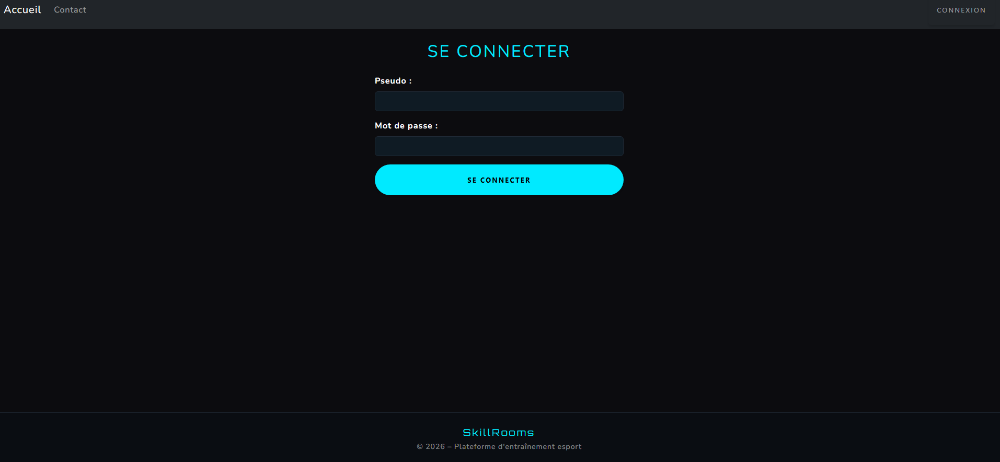
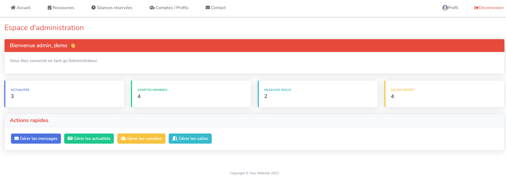
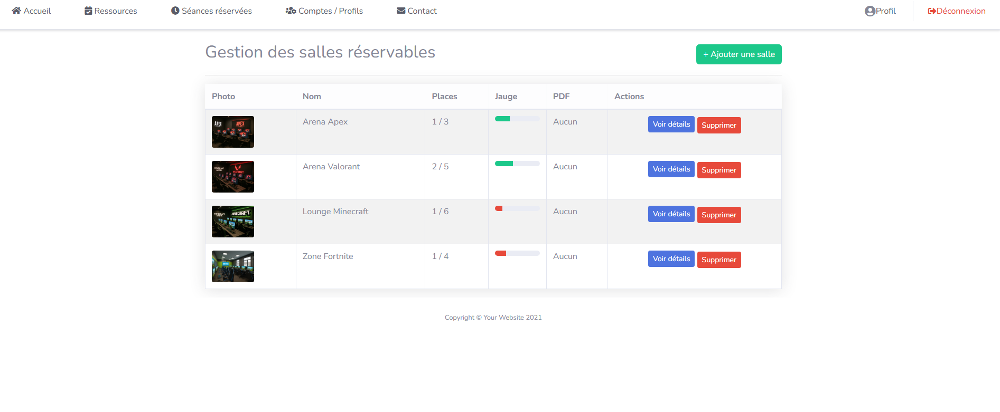

# 🎮 SkillRooms - Gestion de salles eSport

Application web développée dans le cadre de ma Licence Informatique à l'Université de Bretagne Occidentale.

SkillRooms est une plateforme de gestion et de réservation de salles d'entraînement eSport avec deux espaces distincts : administrateur et membre.

## ✨ Fonctionnalités

- Authentification et gestion des sessions
- Gestion des rôles administrateur et membre
- Consultation et modification du profil utilisateur
- Gestion des comptes par l'administrateur
- Gestion des salles eSport
- Consultation des réservations par date
- Gestion des indisponibilités des salles
- Formulaire de contact et suivi des messages
- Tableau de bord avec les principaux indicateurs
- Consultation de la liste des membres

## 🛠️ Technologies utilisées

- **PHP 8.1+**
- **CodeIgniter 4**
- **MySQL / MariaDB**
- **HTML5 / CSS3**
- **Bootstrap**
- **JavaScript**
- **Git**

## 🗂️ Structure principale

```text
app/
  Config/          Routes et configuration
  Controllers/     Contrôleurs de l'application
  Models/          Accès et traitement des données
  Views/           Interfaces utilisateur

public/             Ressources publiques
database/schema.sql Schéma de la base de données
docs/screenshots/   Captures d'écran
```
## Captures d'ecran

### Accueil


### Connexion



### Tableau de bord administrateur



### Gestion des salles


